# AeroProp Logic Harness (APLH)

**Engineering knowledge harness for civil aviation propulsion system control logic.**

APLH provides a structured, traceable, and reviewable local-first framework for organizing control system requirements, functions, interfaces, abnormal conditions, and terminology.

> **Governance Notice**  
> This is a development-aid / review-aid system. It is NOT certified airborne software, nor does it replace formal airworthiness compliance activities.

## Phase Status

Currently at **Phase 0 + Phase 1 + Phase 2A + Phase 2B + Phase 2C + Phase 3-1 + Phase 3-2 + Phase 3-3 + Phase 3-4 (Accepted) + Phase 4 (Accepted) + Phase 5 (Accepted) + Phase 6 (Accepted) + Phase 7 (Accepted) + Post-Phase7 Formal Population Authorization Planning (Accepted) + Post-Phase7 Authorization Request Package (Accepted) + Executable Formal Population Approval Created + Corrected-Inventory Approval Planning Package Accepted + Corrected-Inventory Approval Request Package Accepted + Corrected-Inventory Executable Formal Population Approval Created + Corrected-Inventory Controlled Population Accepted + Post-Phase7 Freeze-Review Intake Governance Planning Package Accepted + Post-Phase7 Manual Review Intake Request Package Accepted + Post-Phase7 Manual Review Intake Action Accepted + Post-Phase7 Final Freeze Signoff Governance Planning Package Accepted**.

If you want the non-technical project view first, start with [`docs/MILESTONE_BOARD.md`](/Users/Zhuanz/20260402 AI ControlLogicMaster/docs/MILESTONE_BOARD.md).

## Milestone Flow

```mermaid
flowchart LR
    A["Phase 0-1\nGovernance + Foundation\nAccepted"]
    B["Phase 2A-2C\nModels + Validation + Demo Execution\nAccepted"]
    C["Phase 3-1 to 3-4\nDemo Strengthening + Handoff Quality\nAccepted"]
    D["Phase 4-5\nFormal Readiness + Promotion Path\nAccepted"]
    E["Phase 6\nFreeze-Review Preparation\nAccepted"]
    F["Phase 7\nFormal Population Mechanism\nAccepted"]
    G["Corrected Controlled Population\nFormal Baseline Populated\nAccepted"]
    H["Freeze-Review Intake Governance Planning\nAccepted"]
    I["Manual Review Intake Request Package\nAccepted"]
    J["Manual Review Intake Action\nAccepted"]
    K["Final Freeze Signoff Governance Planning\nAccepted"]
    L["Checklist Completion Request Package\nNext"]
    M["Final Freeze Signoff\nNot Started"]

    A --> B --> C --> D --> E --> F --> G --> H --> I --> J --> K --> L --> M
```



## Plain-Language Snapshot

The project is no longer blocked on core code implementation. The formal baseline has already been populated and post-validated. The current missing step is a **non-executable checklist-completion request package for the final freeze side**, not a new engineering subsystem:

- machine/manual readiness: `accepted_for_review`
- current governance state: manual intake action accepted
- current package: final freeze signoff checklist completion request package
- freeze signoff: still not started

## Detailed Phase Ledger

- **Phase 0 (Governance):** Boundaries, schemas, review gates, and routing policies are established.
- **Phase 1 (Knowledge Foundation):** Data models, templates, traceability skeleton, and basic validators are implemented.
- **Phase 2A (Schema Extension):** MODE, TRANSITION, and GUARD artifact models, GUARD predicate grammar, additive fields on P0/P1 models, and 11 new trace directions are implemented.
- **Phase 2B (Graph / Validation):** ModeGraph read-only directed graph, ModeValidator, and CoverageValidator are implemented.
- **Phase 2C (Execution Readiness):** Demo-scale Scenario Engine, GuardEvaluator, RuntimeState, DecisionTrace, and T2 signoff hooks are implemented.
- **Phase 3-1 (Tech Debt + Audit Identity):** Signoff schema hardening, reviewer parameterization, run_id/scenario_id correlation.
- **Phase 3-2 (Scenario/Replay Strengthening):** Scenario validator, replay reader, trace persistence, 3 new CLI commands, 3 new demo scenarios.
- **Phase 3-3 (Richer Evaluator Boundary):** RicherEvaluator adapter with 6 operators (DELTA_GT/LT, IN_RANGE, SUSTAINED_GT/LT, HYSTERESIS_BAND), structured explainability, demo baseline cross-ref fixes, `--richer` CLI flag.
- **Phase 3-4 (Enhanced Demo-Scale Handoff):** Baseline cleanup, trace/signoff correlation, and comprehensive demo-scale handoff bundle builder.
- **Phase 4 (Formal Readiness / Controlled Promotion):** Rigorous mechanism to check freeze prerequisites (`assess-readiness`) and promotion policy/evidence validation (`check-promotion`).
- **Phase 5 (Actual Promotion Path):** Accepted — Physical executor (`execute-promotion`) and lifecycle management for moving artifacts to Formal without declaring a formal freeze.
- **Phase 6 (Formal Population Governance / Freeze-Review Preparation):** Accepted — formal state classification, hard post-validation gating, governance-only `.aplh` review packets, and the P1 manual-intake fix are implemented and independently accepted. Later corrected controlled population has now moved the formal baseline to `ready_for_freeze_review`; `freeze-complete` remains manual-only.
- **Phase 7 (Formal Baseline Population):** Accepted — adds the bounded `populate-formal` path with reviewed approval intake, deterministic source allowlists, sandbox validation, controlled formal writes, manifest/audit corroboration, and Phase 6 reassessment. Later corrected controlled population has now populated the real checked-in formal baseline; `freeze-complete` remains manual-only.
- **Post-Phase7 Formal Population Authorization Planning:** Accepted — freezes the next missing governance object: a reviewed authorization packet for a future controlled population run. It does not create an executable approval, populate formal artifacts, enter freeze review, or start Phase 8.
- **Post-Phase7 Authorization Request Package:** Accepted — the non-executable Markdown request packet has passed independent review. This still does not create executable approval YAML, run `populate-formal`, populate formal artifacts, enter freeze review, or start Phase 8; the next step is a separate independent approval action.
- **Post-Phase7 Formal Population Approval Action:** Granted — the first executable `FormalPopulationApproval` YAML, `FORMAL-POP-APPROVAL-20260407-001`, was created under `artifacts/.aplh/formal_population_approvals/`. This action did not run `populate-formal`, populate formal artifacts, enter freeze review, declare `freeze-complete`, or start Phase 8.
- **Post-Phase7 Controlled Population Execution:** Blocked — the authorized `populate-formal` command ran exactly once and failed during sandbox validation because `CoverageValidator` reported `ABN-0001` is not referenced by any `MODE.related_abnormals` or `TRANS.related_abnormals`. No formal artifacts, formal population audit log, formal promotions log, promoted manifest, freeze-review intake state, or `freeze-complete` state were created.
- **Post-Phase7 Controlled Population Blocker Resolution:** Requires re-approval — the `ABN-0001` coverage blocker is fixed in the demo source by adding the `ABN-0001 -> MODE-0002` relationship and `TRACE-0030`, and sandbox validation now passes. The live inventory changed from `49` to `50`, so the existing approval `FORMAL-POP-APPROVAL-20260407-001` is stale and must not be reused for another population attempt.
- **Post-Phase7 Corrected-Inventory Approval Planning:** Accepted — the corrected `50`-file inventory approval path is planned and independently accepted. The old `49`-file approval remains historical and stale; planning did not create new executable approval YAML, populate formal artifacts, or authorize controlled population execution.
- **Post-Phase7 Corrected-Inventory Approval Request Package:** Accepted — the corrected `50`-file inventory request packet passed independent review. The request package proposed future approval ID `FORMAL-POP-APPROVAL-20260407-002` but did not itself create executable approval YAML, run `populate-formal`, populate formal artifacts, enter freeze review, or start Phase 8.
- **Post-Phase7 Corrected-Inventory Approval Action:** Granted — executable approval `FORMAL-POP-APPROVAL-20260407-002` was created for the corrected `50`-file inventory. This approval action itself did not run `populate-formal`; the later corrected controlled population execution did.
- **Post-Phase7 Corrected-Inventory Controlled Population Execution:** Executed — the single authorized `populate-formal` command for approval `002` completed successfully, populated `50` formal artifact YAML files, created the formal population audit log, created the formal promotions log, created promoted manifest `FORMAL-POP-20260407142521`, and updated Phase 6 readiness to `ready_for_freeze_review`. This execution has now been independently reviewed and accepted. `freeze_gate_status.yaml` remains manual-only, `freeze-complete` is not declared, and manual review states were later set separately to `accepted_for_review`.
- **Post-Phase7 Corrected-Inventory Controlled Population Review:** Accepted — independent review found no blocking issues. This acceptance is not freeze approval, does not authorize immediate freeze-review intake, does not set manual review states, and does not start Phase 8.
- **Post-Phase7 Freeze-Review Intake Governance Planning:** Accepted — independent planning review accepted the next package as a non-executable manual review intake request package. This planning acceptance does not write `acceptance_audit_log.yaml`, does not set `accepted_for_review` or `pending_manual_decision`, does not modify `freeze_gate_status.yaml`, does not declare `freeze-complete`, and does not start Phase 8.
- **Post-Phase7 Manual Review Intake Request Package:** Accepted — the non-executable Markdown request packet passed independent review. This acceptance still does not write manual intake state, does not modify `freeze_gate_status.yaml`, does not declare `freeze-complete`, does not enter freeze-review intake, and does not start Phase 8. The next bounded step is a separate manual review intake action by an authorized actor.
- **Post-Phase7 Manual Review Intake Action:** Accepted — one authorized `manual_review_intake` entry with `state_after: accepted_for_review` has been independently reviewed and accepted. The refreshed reflective Phase 6 packet now reports `formal_state: accepted_for_review` and `G6-E` passes. This is still not freeze approval, does not modify `freeze_gate_status.yaml`, does not declare `freeze-complete`, and does not start Phase 8.
- **Post-Phase7 Final Freeze Signoff Governance Planning:** Accepted — independent planning review confirmed that a checklist-completion request package is the smallest correct next step before any later freeze signoff consideration. This acceptance does not write `freeze_gate_status.yaml`, does not declare `freeze-complete`, and does not start Phase 8.

## Directory Structure

- `aero_prop_logic_harness/`: Core Python package (models, loaders, validators, CLI)
- `artifacts/`: **Formal baseline root** — the only directory eligible for `freeze-complete` scope
  - `artifacts/examples/minimal_demo_set/`: Demo-scale baseline (structurally complete but NOT formal)
  - `artifacts/.aplh/`: Control metadata for governance records and manual freeze signoff
  - (Phase 2A formal population target) `modes/`, `transitions/`, `guards/` are now populated by the corrected controlled population execution; this still does not declare `freeze-complete`
- `docs/`: Governance, architecture, and handoff documentation
- `schemas/`: JSON Schema definitions for cross-language compatibility (9 types: 6 P0/P1 + 3 Phase 2A)
- `templates/`: YAML templates for authoring new artifacts (8 templates)
- `tests/`: `pytest` suite for schema, consistency, and Phase 2A model logic

## Installation

APLH uses standard Python packaging and requires Python 3.11+. We recommend using a virtual environment.

```bash
# Create and activate virtual environment
python3 -m venv .venv
source .venv/bin/activate

# Install the package and CLI
pip install -e ".[dev]"
```

## CLI Usage

The system provides a lightweight CLI for validation and checking.

You must execute CLI commands via the module pattern to guarantee environment consistency:

```bash
# Validating schemas and structural integrity for a chosen artifact subtree:
python -m aero_prop_logic_harness validate-artifacts --dir <artifact_subtree>

# Checking trace links for graph consistency (demo-scale example):
python -m aero_prop_logic_harness check-trace --dir artifacts/examples/minimal_demo_set

# Evaluating the freeze gate (demo-scale — outputs "Demo-scale gate checks passed"):
python -m aero_prop_logic_harness freeze-readiness --dir artifacts/examples/minimal_demo_set

# Evaluating the freeze gate (formal baseline root):
python -m aero_prop_logic_harness freeze-readiness --dir artifacts
```

### Phase 3-2 Commands (Scenario / Replay / Audit)

```bash
# Validate a scenario file against the ModeGraph (structural pre-check):
python -m aero_prop_logic_harness validate-scenario --dir artifacts/examples/minimal_demo_set --scenario artifacts/examples/minimal_demo_set/scenarios/test.yml

# Run a scenario (now persists trace to .aplh/traces/):
python -m aero_prop_logic_harness run-scenario --dir artifacts/examples/minimal_demo_set --scenario artifacts/examples/minimal_demo_set/scenarios/test.yml

# Replay a scenario against an expected trace for deterministic consistency:
python -m aero_prop_logic_harness replay-scenario --dir artifacts/examples/minimal_demo_set --scenario artifacts/examples/minimal_demo_set/scenarios/test.yml --trace artifacts/examples/minimal_demo_set/.aplh/traces/run_RUN-XXXX_SCENARIO-DEMO_YYYYMMDDTHHMMSSZ.yaml

# Inspect a persisted run trace by run_id (tick-by-tick readback + signoff correlation):
python -m aero_prop_logic_harness inspect-run --dir artifacts/examples/minimal_demo_set --run-id RUN-XXXXXXXXXXXX

# Phase 3-4: Clean up demo baseline legacy/residue artifacts:
python -m aero_prop_logic_harness clean-baseline --dir artifacts/examples/minimal_demo_set --dry-run
python -m aero_prop_logic_harness clean-baseline --dir artifacts/examples/minimal_demo_set --prune

# Phase 3-4: Build formal handoff bundle from demo baseline:
python -m aero_prop_logic_harness build-handoff --dir artifacts/examples/minimal_demo_set
```

### Phase 4 Commands (Formal Readiness & Promotion)

```bash
# Phase 6: Assess formal freeze-review readiness and write governance packet
python -m aero_prop_logic_harness assess-readiness --dir artifacts --demo artifacts/examples/minimal_demo_set

# Phase 4: Identify candidates to promote and validate their integration into the formal baseline (Dry-Run, outputs a Manifest record)
python -m aero_prop_logic_harness check-promotion --dir artifacts --demo artifacts/examples/minimal_demo_set

# Phase 5/6: Execute actual physical promotion based on a Manifest ID
# Note: physical copy is no longer sufficient by itself; post-validation is a hard gate
python -m aero_prop_logic_harness execute-promotion MANIFEST-2026...

# Phase 7: Populate formal baseline through reviewed approval + sandbox validation
python -m aero_prop_logic_harness populate-formal --approval <reviewed-approval.yaml> --dir artifacts --demo artifacts/examples/minimal_demo_set
```

To run the testing suite hermetically:
```bash
python -m pytest
```

### Formal vs Demo-scale Baselines

- **Formal baseline root** (`artifacts/`): The only directory where `freeze-complete` signoff is valid. The CLI programmatically verifies directory identity — YAML signoff alone cannot grant formal status.
- **Demo-scale baseline** (`artifacts/examples/minimal_demo_set/`): Structurally complete for validation demos. `freeze-readiness` will output "Demo-scale gate checks passed (Not for formal freeze)" — never "Ready for Formal Baseline Freeze".
- **`.aplh/` directories**: Control metadata only. They are not baseline source-of-truth. The Phase 6 planning baseline freezes which governance records may live there and which files must remain manual-only; see `docs/PHASE6_ARCHITECTURE_PLAN.md` and `docs/PHASE6_FIX_REVIEW_REPORT.md`.

## Artifact Contribution Workflow

1. Copy the appropriate template from `templates/` into the correct `artifacts/` subdirectory.
2. Follow the naming convention in `docs/ID_AND_NAMING_CONVENTIONS.md` (e.g., `req-0042.yaml`).
3. Fill out the YAML fields. Pay special attention to `provenance` and `confidence`.
4. Run `python -m aero_prop_logic_harness validate-artifacts --dir <target_dir>` to ensure it parses correctly.
5. Create necessary traces in `artifacts/trace/`.
6. Run `python -m aero_prop_logic_harness check-trace --dir <target_dir>` to verify cross-references.

## Next Steps

See `docs/README.md` for the current documentation index.

For the shortest human-readable status view, see `docs/MILESTONE_BOARD.md`.

Primary current references:

- `docs/PHASE5_REVIEW_REPORT.md` — authoritative Phase 5 acceptance and advisory source
- `docs/PHASE5_IMPLEMENTATION_NOTES.md` — Phase 5 implementation details
- `docs/PHASE6_ARCHITECTURE_PLAN.md` — accepted Phase 6 planning baseline
- `docs/PHASE6_PLAN_REVIEW_REPORT.md` — authoritative Phase 6 planning acceptance record
- `docs/PHASE6_IMPLEMENTATION_NOTES.md` — Phase 6 implementation summary and review handoff
- `docs/PHASE6_REVIEW_REPORT.md` — historical Phase 6 implementation review result (`Revision Required`)
- `docs/PHASE6_FIX_NOTES.md` — P1 revision fix notes
- `docs/PHASE6_FIX_REVIEW_REPORT.md` — authoritative Phase 6 fix re-review acceptance record
- `docs/PHASE6_FIX_REVIEW_INPUT.md` — historical independent fix re-review input that produced `Phase 6 Accepted`
- `docs/PHASE6_REVIEW_INPUT.md` — historical independent implementation review input that produced `Revision Required`
- `docs/PHASE6_REREVIEW_INPUT.md` — frozen historical input that produced the planning acceptance
- `docs/POST_PHASE6_NEXT_PLANNING_INPUT.md` — historical controlled planning handoff after Phase 6 acceptance
- `docs/PHASE7_FORMAL_POPULATION_PLAN.md` — accepted Phase 7 formal population planning baseline
- `docs/PHASE7_PLANNING_REVIEW_REPORT.md` — authoritative Phase 7 planning acceptance record
- `docs/PHASE7_PLANNING_REVIEW_INPUT.md` — historical independent planning review input that produced `Planning Accepted`
- `docs/PHASE7_EXEC_INPUT.md` — bounded Phase 7 implementation handoff
- `docs/PHASE7_IMPLEMENTATION_NOTES.md` — Phase 7 implementation summary
- `docs/PHASE7_REVIEW_INPUT.md` — historical independent Phase 7 implementation review input
- `docs/PHASE7_REVIEW_REPORT.md` — authoritative Phase 7 implementation acceptance record
- `docs/POST_PHASE7_NEXT_PLANNING_INPUT.md` — historical controlled next-planning handoff after Phase 7 acceptance
- `docs/POST_PHASE7_FORMAL_POPULATION_AUTHORIZATION_PLAN.md` — accepted post-Phase7 formal population authorization planning baseline
- `docs/POST_PHASE7_AUTHORIZATION_PLANNING_REVIEW_INPUT.md` — historical independent planning review input for the post-Phase7 authorization package
- `docs/POST_PHASE7_AUTHORIZATION_PLANNING_REVIEW_REPORT.md` — authoritative post-Phase7 authorization planning acceptance record
- `docs/POST_PHASE7_AUTHORIZATION_REQUEST_INPUT.md` — bounded non-executable authorization request package handoff
- `docs/POST_PHASE7_FORMAL_POPULATION_APPROVAL_REQUEST.md` — accepted non-executable formal population approval request packet
- `docs/POST_PHASE7_AUTHORIZATION_REQUEST_REVIEW_INPUT.md` — historical independent review input for the request packet
- `docs/POST_PHASE7_AUTHORIZATION_REQUEST_REVIEW_REPORT.md` — authoritative request-package acceptance record
- `docs/POST_PHASE7_FORMAL_POPULATION_APPROVAL_ACTION_INPUT.md` — historical independent approval-action input
- `docs/POST_PHASE7_FORMAL_POPULATION_APPROVAL_ACTION_REPORT.md` — authoritative approval action report
- `docs/POST_PHASE7_CONTROLLED_POPULATION_EXECUTION_INPUT.md` — historical controlled population execution handoff
- `docs/POST_PHASE7_CONTROLLED_POPULATION_EXECUTION_REPORT.md` — controlled population execution result (`Controlled Population Execution Blocked`)
- `docs/POST_PHASE7_CONTROLLED_POPULATION_BLOCKER_RESOLUTION_INPUT.md` — historical bounded blocker-resolution handoff
- `docs/POST_PHASE7_CONTROLLED_POPULATION_BLOCKER_RESOLUTION_REPORT.md` — source blocker fix result and approval invalidation decision
- `docs/POST_PHASE7_CORRECTED_INVENTORY_APPROVAL_PLANNING_INPUT.md` — historical corrected-inventory approval planning handoff
- `docs/POST_PHASE7_CORRECTED_INVENTORY_APPROVAL_PLAN.md` — accepted corrected-inventory approval planning baseline
- `docs/POST_PHASE7_CORRECTED_INVENTORY_APPROVAL_PLANNING_REVIEW_INPUT.md` — historical independent planning review input
- `docs/POST_PHASE7_CORRECTED_INVENTORY_APPROVAL_PLANNING_REVIEW_REPORT.md` — authoritative corrected-inventory planning acceptance record
- `docs/POST_PHASE7_CORRECTED_INVENTORY_APPROVAL_REQUEST_INPUT.md` — historical corrected-inventory non-executable request package handoff
- `docs/POST_PHASE7_CORRECTED_INVENTORY_APPROVAL_REQUEST.md` — accepted corrected non-executable approval request packet for the `50`-file inventory
- `docs/POST_PHASE7_CORRECTED_INVENTORY_APPROVAL_REQUEST_REVIEW_INPUT.md` — historical independent request-package review input
- `docs/POST_PHASE7_CORRECTED_INVENTORY_APPROVAL_REQUEST_REVIEW_REPORT.md` — authoritative corrected request-package acceptance record
- `docs/POST_PHASE7_CORRECTED_INVENTORY_APPROVAL_ACTION_INPUT.md` — historical independent approval-action handoff for `002` approval creation
- `docs/POST_PHASE7_CORRECTED_INVENTORY_APPROVAL_ACTION_REPORT.md` — authoritative corrected approval-action report
- `artifacts/.aplh/formal_population_approvals/FORMAL-POP-APPROVAL-20260407-001.yaml` — historical executable approval; stale for the corrected `50`-file inventory
- `artifacts/.aplh/formal_population_approvals/FORMAL-POP-APPROVAL-20260407-002.yaml` — executable corrected approval used for the successful corrected controlled population run
- `docs/POST_PHASE7_CORRECTED_INVENTORY_CONTROLLED_POPULATION_EXECUTION_INPUT.md` — historical bounded controlled execution handoff for the corrected approval
- `docs/POST_PHASE7_CORRECTED_INVENTORY_CONTROLLED_POPULATION_EXECUTION_REPORT.md` — corrected controlled population execution result
- `docs/POST_PHASE7_CORRECTED_INVENTORY_CONTROLLED_POPULATION_REVIEW_INPUT.md` — historical independent review input for the successful corrected controlled population
- `docs/POST_PHASE7_CORRECTED_INVENTORY_CONTROLLED_POPULATION_REVIEW_REPORT.md` — authoritative corrected controlled population acceptance record
- `docs/POST_PHASE7_FREEZE_REVIEW_INTAKE_GOVERNANCE_PLANNING_INPUT.md` — historical governance planning handoff before any freeze-review intake
- `docs/POST_PHASE7_FREEZE_REVIEW_INTAKE_GOVERNANCE_PLAN.md` — accepted freeze-review intake governance planning baseline
- `docs/POST_PHASE7_FREEZE_REVIEW_INTAKE_GOVERNANCE_PLANNING_REVIEW_INPUT.md` — historical independent planning review input
- `docs/POST_PHASE7_FREEZE_REVIEW_INTAKE_GOVERNANCE_PLANNING_REVIEW_REPORT.md` — authoritative planning acceptance record
- `docs/POST_PHASE7_MANUAL_REVIEW_INTAKE_REQUEST_INPUT.md` — historical bounded handoff for a non-executable manual review intake request package
- `docs/POST_PHASE7_MANUAL_REVIEW_INTAKE_REQUEST.md` — accepted non-executable manual review intake request packet
- `docs/POST_PHASE7_MANUAL_REVIEW_INTAKE_REQUEST_REVIEW_INPUT.md` — historical independent request-package review input
- `docs/POST_PHASE7_MANUAL_REVIEW_INTAKE_REQUEST_REVIEW_REPORT.md` — authoritative request-package acceptance record
- `docs/POST_PHASE7_MANUAL_REVIEW_INTAKE_ACTION_INPUT.md` — historical manual review intake action handoff for the single allowed audit-log write
- `docs/POST_PHASE7_MANUAL_REVIEW_INTAKE_ACTION_REPORT.md` — historical manual review intake action result; independently accepted in the review report
- `docs/POST_PHASE7_MANUAL_REVIEW_INTAKE_ACTION_REVIEW_INPUT.md` — historical independent review scope that produced action acceptance
- `docs/POST_PHASE7_MANUAL_REVIEW_INTAKE_ACTION_REVIEW_REPORT.md` — authoritative acceptance record for the manual review intake action
- `docs/POST_PHASE7_FINAL_FREEZE_SIGNOFF_GOVERNANCE_PLANNING_INPUT.md` — historical governance-planning handoff that produced the current planning package
- `docs/POST_PHASE7_FINAL_FREEZE_SIGNOFF_GOVERNANCE_PLAN.md` — accepted final freeze signoff governance planning baseline
- `docs/POST_PHASE7_FINAL_FREEZE_SIGNOFF_GOVERNANCE_PLANNING_REVIEW_INPUT.md` — historical independent planning review scope that produced planning acceptance
- `docs/POST_PHASE7_FINAL_FREEZE_SIGNOFF_GOVERNANCE_PLANNING_REVIEW_REPORT.md` — authoritative planning acceptance record
- `docs/POST_PHASE7_FINAL_FREEZE_SIGNOFF_CHECKLIST_COMPLETION_REQUEST_INPUT.md` — next non-executable checklist-completion request-package handoff

The next step is **a non-executable checklist-completion request package for the final freeze signoff path** in `APLH-PostPhase7-Final-Freeze-Signoff-Checklist-Completion-Request-Package`, using `docs/POST_PHASE7_FINAL_FREEZE_SIGNOFF_CHECKLIST_COMPLETION_REQUEST_INPUT.md`, `docs/POST_PHASE7_FINAL_FREEZE_SIGNOFF_GOVERNANCE_PLAN.md`, and `docs/POST_PHASE7_FINAL_FREEZE_SIGNOFF_GOVERNANCE_PLANNING_REVIEW_REPORT.md`. Do not modify `freeze_gate_status.yaml`, do not declare `freeze-complete`, do not enter final freeze signoff, and do not start Phase 8 from that request-package session.
